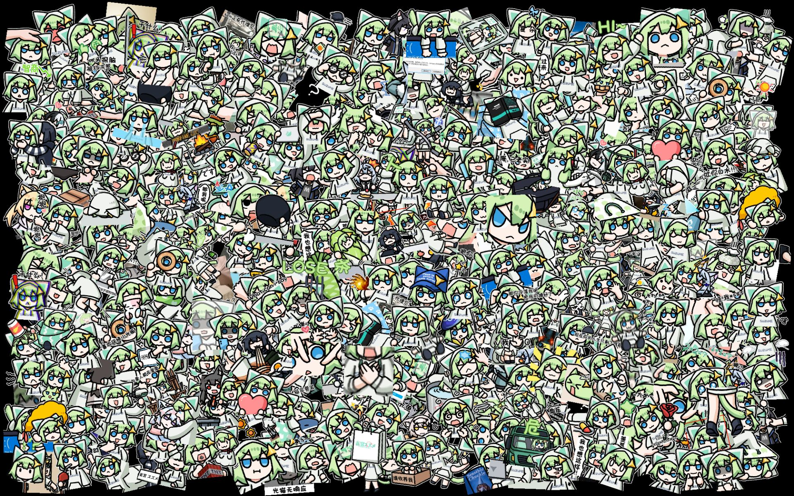

# 随机绿猫生成器

## 项目简介
仿绿猫鼠标垫风格的图片生成器。由于找不到相关的痛车图片，随便动手写了这么个小工具来生成类似的图片，纯粹是好玩，技术含量不高。生成部分是gpt写的，我就写了逻辑部分。
## 使用说明
1. **安装依赖**  
   本程序使用Python，确保已安装以下依赖：
   ```bash
   pip install numpy Pillow tqdm
   ```
2. **配置文件**  
   配置信息位于文件的头部。如有需要，可以根据注释自行修改：
   - 可以修改画布大小、使用的表情包数量、最大重试次数等。
   - 将Develop Mode的值改为true来开启调试模式。
   - 当然这个东西也可以用于其他图片的生成，把绿猫换掉就好了。

3. **图片资源**  
   拼贴的图片需要你自行准备，并将其存放在项目的 `images` 文件夹内。你也可以直接使用我在 `images` 文件夹里放的部分表情包。

4. **运行项目**  
   运行主程序：
   ```bash
   python suzume.py
   ```

 ## 版权信息

- **Bilibili** @没有未来的Suzume酱
- **画师**：五十根炸虾
- 关注绿猫喵 灌注绿猫谢谢喵